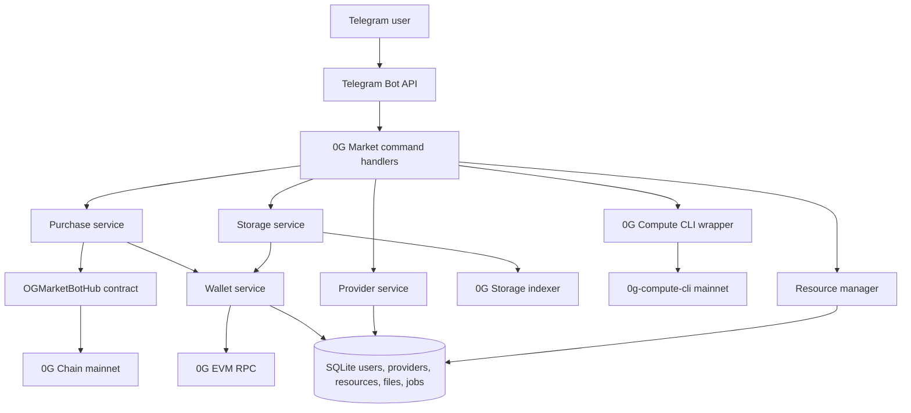

# 0G Market Bot

0G Market Bot is a Telegram marketplace for 0G mainnet storage and compute routes with contract-backed purchase intents and verifiable explorer activity.

## Basic Project Information

Project name: **0G Market Bot**

One-sentence description, under 30 words:

> Telegram marketplace for 0G mainnet storage and compute, with provider discovery, workload estimates, uploads, and contract-backed purchase intents.

Short summary:

0G Market Bot gives users a chat-native market surface for 0G infrastructure. Users can browse storage and compute routes, compare prices, estimate workload cost from a natural-language description, upload files through the configured 0G Storage indexer, buy storage or compute through a deployed 0G Chain hub contract, and track purchased resources in Telegram.

Problem solved:

Infrastructure marketplaces are hard to use when discovery, wallet funding, pricing, storage upload, and settlement are split across separate tools. 0G Market Bot packages those actions into one Telegram flow and records paid purchase intents on 0G mainnet so judges can verify real integration.

0G components used:

| Component | Used | How 0G Market Bot uses it |
| --- | --- | --- |
| 0G Chain | Yes | Embedded wallets, balances, payable `buyStorage` and `buyCompute` contract calls, explorer links. |
| 0G Storage | Yes | File upload flow uses the configured storage indexer and persists storage roots/transaction hashes. |
| 0G Compute | Yes | Provider and model discovery use the 0G Compute CLI, and compute purchases are recorded on-chain. |
| 0G DA | No | Not claimed for this build. |
| Agent ID | No | Not claimed for this build. |
| Privacy / Secure Execution | No | Not claimed for this build. |

Prize track fit:

- **Track 2: Agentic Trading Arena (Verifiable Finance)** because the project models verifiable purchase and pricing flows for infrastructure resources.
- **Track 3: Agentic Economy & Autonomous Applications** because it is a service marketplace for agent-era storage and compute demand.

## 0G Integration Proof

Mainnet contract address:

```text
0x6Eea20692c0f1E0B3400b71a849c4DFAa169E14D
```

Explorer links:

- Contract: <https://chainscan.0g.ai/address/0x6Eea20692c0f1E0B3400b71a849c4DFAa169E14D>
- Deployment transaction: <https://chainscan.0g.ai/tx/0xf306a65590c93ef1705832f6279cfd2fb364c11d987fdd6413fc05801ba5a56e>

On-chain proof summary, under 300 characters:

```text
0G Market Bot is deployed on 0G mainnet at 0x6Eea20692c0f1E0B3400b71a849c4DFAa169E14D. The bot sends payable buyStorage(...) and buyCompute(...) calls, producing explorer-verifiable StoragePurchased and ComputePurchased events.
```

Contract functions used by the bot:

| Function | Trigger | Purpose |
| --- | --- | --- |
| `buyStorage(uint256 providerId,uint256 amountGb,uint256 durationMonths,string route)` | `/buy_storage` confirmation | Records a paid storage purchase intent and emits `StoragePurchased`. |
| `buyCompute(uint256 providerId,uint256 vcpuHours,string route)` | `/buy_compute` confirmation | Records a paid compute purchase intent and emits `ComputePurchased`. |
| `withdraw(address to,uint256 amount)` | Owner only | Allows the contract owner to withdraw accumulated intent funds. |

Events used as judge-verifiable evidence:

| Event | Evidence value |
| --- | --- |
| `StoragePurchased` | Shows buyer, provider ID, GB amount, duration, route, value, and timestamp. |
| `ComputePurchased` | Shows buyer, provider ID, vCPU-hours, route, value, and timestamp. |

## Progress During Hackathon

- Built a Telegram marketplace backend around `python-telegram-bot`, Web3.py, SQLite, and encrypted user wallets.
- Added `/commands` so users can discover available actions without rerunning `/start`.
- Added 0G mainnet configuration for chain RPC, explorer, storage indexer, compute API, compute CLI, and hub contract.
- Deployed `OGMarketBotHub` to 0G mainnet and wired storage/compute purchase flows to its ABI.
- Added provider browsing, provider comparison, workload estimation, purchase confirmation, resource tracking, job status, and earnings views.
- Added 0G Storage upload support with file metadata persistence.
- Added 0G Compute CLI discovery for live provider and model visibility.
- Moved production operation to a 24/7 VPS service with systemd after Render free-tier spin-down caused downtime.

## System Architecture



Technical description:

The bot runs as a Python backend process. Telegram commands are registered in `bot/main.py` through modular handlers. The database seeds local storage and compute routes, stores encrypted wallet records, tracks resources, tracks uploaded files, and tracks jobs. Purchases are not fake local records only: the purchase service ABI-encodes calls to `OGMarketBotHub` and sends payable transactions from the user's embedded 0G wallet. Storage uploads use the configured 0G Storage indexer. Compute discovery uses the 0G Compute CLI configured for mainnet.

## Command Surface

| Command | Description |
| --- | --- |
| `/start` | Create or load the user's wallet and show a quick overview. |
| `/commands` | Show available commands without rerunning onboarding. |
| `/help` | Show detailed usage help. |
| `/stack` | Show the configured 0G mainnet stack used by the bot. |
| `/storage_providers` | Show storage route information and configured purchase routes. |
| `/compute_providers` | Show live 0G Compute network output plus bot purchase routes. |
| `/compute_models` | List 0G Compute model catalog through the CLI integration. |
| `/compare <id1> <id2>` | Compare provider routes or list available comparisons. |
| `/buy_storage <provider_id> <GB> [months]` | Confirm and send a payable storage purchase transaction. |
| `/buy_compute <provider_id> <hours>` | Confirm and send a payable compute purchase transaction. |
| `/estimate <description>` | Estimate storage and compute cost from a plain-language workload. |
| `/my_resources` | List the user's active storage/compute resources. |
| `/renew <resource_id> [months]` | Renew a local resource record when supported. |
| `/cancel <resource_id>` | Cancel a local resource record when supported. |
| `/upload` | Upload a Telegram file to 0G Storage. |
| `/files` | List uploaded files. |
| `/job_status` | Show compute job status records. |
| `/earnings` | Show operator/provider earnings tracking. |

## Backend API Documentation

0G Market Bot does not expose a public HTTP API to users. Its backend API is the Telegram command interface plus internal service modules.

Internal service interfaces:

| Module | Key functions/classes | Role |
| --- | --- | --- |
| `bot/services/wallet_service.py` | `WalletService.get_or_create_user`, `get_balance`, `send_transaction`, `get_explorer_url` | Embedded 0G wallet creation, balance reads, signed transactions. |
| `bot/services/provider_service.py` | `ProviderService.list_providers`, `estimate_workload` | Provider browsing, comparison data, workload estimates. |
| `bot/services/purchase_service.py` | `PurchaseService.purchase_storage`, `purchase_compute` | ABI-encodes hub contract calls and sends payable 0G transactions. |
| `bot/services/storage_service.py` | `StorageService.upload_file`, `list_files` | Uploads files to 0G Storage indexer and stores metadata. |
| `bot/services/resource_manager.py` | `renew_resource`, `cancel_resource` | Tracks resource lifecycle in SQLite. |
| `bot/services/og_compute_cli.py` | `network_status`, `list_compute_providers`, `list_models` | Wraps 0G Compute CLI calls. |
| `bot/services/earnings_service.py` | `get_summary`, `register_provider` | Tracks operator earnings metadata. |

Important environment variables:

| Variable | Purpose |
| --- | --- |
| `TELEGRAM_BOT_TOKEN` | Telegram bot token. |
| `WALLET_ENCRYPTION_KEY` | Fernet key used to encrypt wallet private keys. |
| `DATABASE_PATH` | SQLite database path. |
| `OG_RPC_URL` | 0G mainnet RPC endpoint, default `https://evmrpc.0g.ai`. |
| `OG_CHAIN_ID` | 0G mainnet chain ID, default `16661`. |
| `OG_EXPLORER` | 0G explorer base URL. |
| `OG_STORAGE_INDEXER` | 0G Storage indexer endpoint. |
| `OG_COMPUTE_API` | Compute API base URL used for display/configuration. |
| `OG_COMPUTE_CLI_BIN` | Preferred compute CLI binary, usually `0g-compute-cli`. |
| `OG_COMPUTE_CLI_RPC` | RPC used by the compute CLI. |
| `OG_COMPUTE_CLI_NETWORK` | Compute CLI network profile, `mainnet` in production. |
| `OG_MARKET_HUB_ADDRESS` | Deployed `OGMarketBotHub` address. |
| `OG_MARKET_STORAGE_ROUTE` | Route label recorded in `buyStorage` events. |
| `OG_MARKET_COMPUTE_ROUTE` | Route label recorded in `buyCompute` events. |

## Tutorial: How the 0G Integration Works

1. A user sends `/start`.
2. The wallet service creates or loads an encrypted embedded 0G wallet.
3. The user funds the wallet with A0GI on 0G mainnet.
4. The user sends `/storage_providers` or `/compute_providers`.
5. Provider handlers show seeded bot routes and live 0G Compute CLI output where available.
6. The user sends `/estimate 100 GB storage and 10 hours compute`.
7. The provider service parses the workload and estimates storage/compute cost.
8. The user sends `/buy_storage 1 100 3`.
9. The purchase handler shows a confirmation button before spending funds.
10. On confirmation, `PurchaseService.purchase_storage` ABI-encodes `buyStorage(...)`.
11. `WalletService.send_transaction` signs and broadcasts the payable transaction to 0G Chain.
12. The returned transaction hash links to the 0G explorer.
13. The user sends `/buy_compute 2 10`.
14. The same flow calls `buyCompute(...)`, leaving a `ComputePurchased` event on the hub contract.
15. The user sends `/upload`, then attaches a file.
16. The storage service posts the file to the configured 0G Storage indexer and stores root/transaction metadata.

## Local Deployment and Reproduction

Prerequisites:

- Python 3.11 or newer
- Node.js 22 or newer for the 0G Compute CLI
- A Telegram bot token
- A Fernet encryption key
- A funded 0G mainnet wallet for paid purchase tests

Install:

```bash
git clone https://github.com/TS-mfon/og-market-bot.git
cd og-market-bot
python3 -m venv .venv
. .venv/bin/activate
pip install -r requirements.txt
npm install -g @0glabs/0g-serving-broker
cp .env.example .env
python3 -c "from cryptography.fernet import Fernet; print(Fernet.generate_key().decode())"
```

Configure `.env`:

```env
TELEGRAM_BOT_TOKEN=replace_me
WALLET_ENCRYPTION_KEY=replace_with_generated_fernet_key
DATABASE_PATH=./data/market.db
OG_RPC_URL=https://evmrpc.0g.ai
OG_CHAIN_ID=16661
OG_EXPLORER=https://chainscan.0g.ai
OG_STORAGE_INDEXER=https://indexer-storage.0g.ai
OG_COMPUTE_API=https://compute.0g.ai
OG_COMPUTE_CLI_BIN=0g-compute-cli
OG_COMPUTE_CLI_RPC=https://evmrpc.0g.ai
OG_COMPUTE_CLI_NETWORK=mainnet
OG_MARKET_HUB_ADDRESS=0x6Eea20692c0f1E0B3400b71a849c4DFAa169E14D
OG_MARKET_STORAGE_ROUTE=0g-storage-mainnet-route
OG_MARKET_COMPUTE_ROUTE=0g-compute-mainnet-route
```

Run locally:

```bash
python -m bot.main
```

Run with Docker:

```bash
docker build -t og-market-bot .
docker run --env-file .env og-market-bot
```

Production VPS service example:

```ini
[Unit]
Description=0G Market Bot Telegram backend
After=network-online.target
Wants=network-online.target

[Service]
WorkingDirectory=/opt/bots/og-market-bot
EnvironmentFile=/opt/bots/og-market-bot/.env
ExecStart=/opt/bots/og-market-bot/.venv/bin/python -m bot.main
Restart=always
RestartSec=5

[Install]
WantedBy=multi-user.target
```

## Reviewer Notes and Test Account Guidance

- This is a mainnet integration, so reviewers need A0GI for paid storage and compute purchase transactions.
- Read-only flows that do not require funding: `/commands`, `/help`, `/stack`, `/storage_providers`, `/compute_providers`, `/compute_models`, `/compare`, `/estimate`.
- Funded flows: `/buy_storage`, `/buy_compute`, and any upload flow that requires a storage transaction from the indexer.
- The contract records purchase intents; it does not guarantee direct provisioning from an external provider marketplace after the event.
- The storage upload service records local metadata even if the storage indexer is temporarily unavailable, and returns a retry note for transparent debugging.
- The compute provider listing uses the 0G Compute CLI. If provider availability changes, the bot displays the current CLI output or error.

## User Testing Notes

Test scenarios completed or prepared for judges:

| Scenario | Steps | Expected result |
| --- | --- | --- |
| Onboarding | Send `/start`, then `/commands` | Bot returns wallet overview and full command list. |
| Stack inspection | Send `/stack` | Bot shows RPC, chain ID, explorer, storage indexer, compute network, and hub contract. |
| Provider discovery | Send `/storage_providers` and `/compute_providers` | Bot shows storage route and live compute/network output where available. |
| Model discovery | Send `/compute_models` | Bot returns the 0G Compute model catalog or the current CLI error. |
| Estimate | Send `/estimate 100 GB storage and 10 hours compute` | Bot returns estimated storage, compute, and total cost. |
| Storage purchase | Fund wallet, send `/buy_storage 1 100 3`, confirm | Bot broadcasts `buyStorage(...)` and returns an explorer link. |
| Compute purchase | Fund wallet, send `/buy_compute 2 10`, confirm | Bot broadcasts `buyCompute(...)` and returns an explorer link. |
| File upload | Send `/upload`, attach a file | Bot uploads to 0G Storage indexer or records retry metadata transparently. |
| Resource tracking | Send `/my_resources` | Bot shows active local purchase records. |
| Explorer verification | Open contract explorer link | Judge can inspect contract and purchase events. |

Known limitations:

- The market routes are bot-managed route records, not a full decentralized order book.
- Purchase events represent verifiable paid intents. External provider fulfillment is the next integration layer.
- Storage download/retrieval is represented by metadata and roots, not a full end-user download client.

## Judging Criteria Alignment

0G Technical Integration Depth and Innovation:

- Combines 0G Chain, 0G Storage, and 0G Compute in one Telegram marketplace.
- Uses a deployed 0G mainnet contract for verifiable storage and compute purchase events.
- Exposes compute discovery and infrastructure purchase flows to users without requiring direct CLI use.

Technical Implementation and Completeness:

- Modular backend with handlers, services, models, database, and contract code.
- User wallet creation, encrypted key storage, balance checks, signed transactions, and explorer links are implemented.
- Purchase confirmation prevents accidental spending.
- VPS/systemd deployment keeps the bot online continuously.

Product Value and Market Potential:

- Simplifies infrastructure discovery and purchasing for AI agents, builders, and non-technical users.
- Can evolve into an agent-facing infrastructure marketplace with provider fulfillment and ratings.
- Natural-language estimation helps users translate workloads into resource requirements.

User Experience and Demo Quality:

- Telegram UX is familiar and fast to demo.
- `/commands` and `/help` make the bot self-guiding.
- Purchase flows return transaction hashes and explorer links for immediate verification.

Team Capability and Documentation:

- This README provides architecture, proof links, setup instructions, service API docs, user testing notes, and judge guidance.
- Contract source and deployment addresses are included in the repository.

## Repository

GitHub repository:

```text
https://github.com/TS-mfon/og-market-bot
```

Source layout:

| Path | Purpose |
| --- | --- |
| `bot/main.py` | Telegram application entrypoint and command registration. |
| `bot/handlers/` | Telegram command handlers. |
| `bot/services/` | Wallet, provider, purchase, storage, compute CLI, resource, and earnings services. |
| `bot/db/` | SQLite schema, seeded providers, and database helpers. |
| `contracts/OGMarketBotHub.sol` | 0G mainnet marketplace hub contract. |
| `Dockerfile` | Container deployment definition. |
| `.env.example` | Reviewer/deployment configuration template. |

## License

MIT
